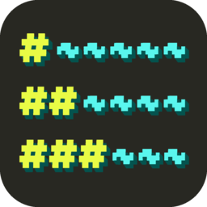
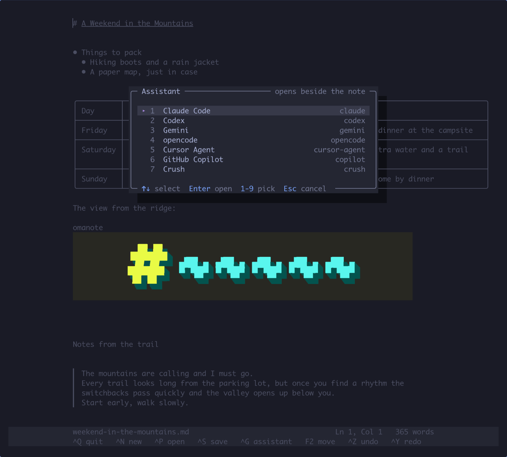

# Omanote for Omarchy

**Obsidian-style notes that live in your terminal.** [omanote](https://github.com/iluxav/omanote) is a markdown editor and viewer in one: what you write renders as you write it, and the raw syntax only shows on the line you are editing. It is a single small binary with nothing to configure, as quick to open as `nano`. This plugin puts it one click, or one key, away.



**What you get**

- **Live preview, no modes.** Headings, **bold**, lists, quotes, checkboxes you can click, code blocks. Just type; the usual `Ctrl+Z` / `Ctrl+C` / `Ctrl+V` and the mouse all work.
- **Real tables.** Drawn as a grid that stays aligned while you type, wraps to fit a narrow tile, and is driven with `Tab` and `Enter` like a spreadsheet.
- **Images in the terminal.** Local files, images from the web, and screenshots pasted straight in with `Ctrl+V`: real pixels in Ghostty and Kitty, a preview elsewhere.
- **Links that stay out of the way.** `[text](url)` and `[[wiki links]]` show as clean text, with the address hidden until you edit the line.
- **Vaults, including GitHub.** Keep notes in as many folders as you like. Add a GitHub repo as a vault and it syncs itself in the background: pulled when you open a note, committed and pushed after you write, never making you wait.
- **An AI agent beside the note.** `Ctrl+G` opens Claude Code, Codex, Gemini, opencode or whichever agent CLI you have installed, in a pane inside omanote, already pointed at the note you are writing. Its edits appear in the note as they land.
- **Plain files.** Every note is ordinary markdown on disk, so it works with git, grep and any other editor.

**What the plugin adds to your desktop**

- **A notes icon in the bar.** Click for the search popup, right-click to jot a quick note, middle-click to sync your GitHub vaults.
- **Search popup**, in the style of the Omarchy menu. Type to find a note in any vault: the name, then the vault it lives in, dimmed. `Enter` opens it. With nothing typed, or nothing matching, `Enter` starts a new note.
- **Quick capture.** A one-line box: type, `Enter`, and the line is in your inbox note. No editor, no window.

## Install

```sh
omarchy plugin add https://github.com/iluxav/omarchy-omanote --enable
```

### It needs omanote

The plugin is only the desktop side. The editor is a separate program, [omanote](https://github.com/iluxav/omanote), and a plugin cannot install programs: installing one is a git checkout of QML, with no install step.

- If `omanote` is already installed, everything works straight away.
- If it is not, the bar icon shows dimmed. Click it and a terminal opens that says exactly what it is about to do, asks, and then installs the omanote release named in [`omanote.pin`](omanote.pin): it downloads that one release from GitHub, checks it against the SHA-256 recorded in the pin, and only then puts it in `~/.local/bin`. Nothing is piped into a shell. It finishes with `omanote --omarchy`, which adds omanote to the app launcher and the Omarchy menu.

You can also install omanote yourself first; see [its README](https://github.com/iluxav/omanote#install).

What the plugin touches: nothing outside its own folder. The installer, when you say yes, writes `~/.local/bin/omanote`; `omanote --omarchy` adds a launcher entry and, only if your Omarchy menu file has no entries of your own, a Notes section to it. Nothing existing is overwritten.

## The bar icon

A sticky note with a `#` on it, drawn as a vector shape in the bar's own foreground colour, so it matches the icons around it and follows your theme. To use another, set `icon` on the widget's entry in `~/.config/omarchy/shell.json`: `"note"` (default), `"page"` (a document with a `#`) or `"outline"` (a `#` heading followed by lines of text).

## Keys

Plugins cannot add keybindings, so add them to `~/.config/hypr/bindings.lua`:

```lua
o.bind("SUPER + N", "Notes", "omarchy-shell shell toggle iluxav.omanote")
-- SUPER+SHIFT+N is Omarchy's "Editor" shortcut; unbind it first, or pick another key.
hl.unbind("SUPER + SHIFT + N")
o.bind("SUPER + SHIFT + N", "Quick note", [[omarchy-shell shell summon iluxav.omanote '{"mode":"capture"}']])
```

Notes open tiled. For a floating window, change `appId` at the top of `Omni.qml` to `"TUI.float"`.

Notes land in `~/.omanote/docs/inbox.md`, under a heading per day:

```markdown
## 2026-09-19
- 14:02 call the dentist
- 16:40 idea: sync state in the bar
```

## Remove

```sh
omarchy plugin remove iluxav.omanote
```

That leaves omanote and your notes alone. To remove omanote too: `rm ~/.local/bin/omanote`, and delete `~/.local/share/applications/Omanote.desktop` and the `notes` entries in `~/.config/omarchy/extensions/omarchy-menu.jsonc` if `omanote --omarchy` added them. Your notes are in `~/.omanote`.

## Developing

The shell caches a plugin's compiled QML: edits to a file it has already loaded, and files added after the plugin was enabled (which fail with a misleading "File name case mismatch"), only take effect after `omarchy restart shell`.

To move the plugin to a newer omanote release, run `./update-pin.sh v0.1.0` and commit `omanote.pin`.

## License

[MIT](LICENSE). omanote itself is MIT as well.
